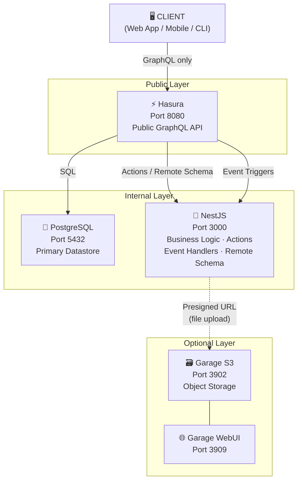

# Stratum

> **Layer by layer, project by project.**

Stratum is an open-source backend boilerplate for developers who want to bootstrap a production-ready backend stack quickly — without repeating the same infrastructure setup every time.

## What is Stratum?

Instead of spending 2–5 days setting up PostgreSQL, GraphQL, auth, object storage, and Docker from scratch, you can fork Stratum, run `./install.sh`, answer a few questions, and start writing business logic immediately.

**Core Stack:**
- 🐘 **PostgreSQL 16** — Primary datastore
- ⚡ **Hasura GraphQL Engine** — Auto-generated CRUD, permissions, subscriptions, event triggers
- 🪺 **NestJS** — Business logic layer, custom resolvers, REST endpoints, webhook handlers
- 🐳 **Docker Compose** — Local dev and production ready
- 🗃️ **Garage S3** _(optional)_ — Lightweight self-hosted S3-compatible object storage

---

## Quick Start

```bash
# 1. Clone the repository
git clone https://github.com/your-org/stratum.git my-project
cd my-project

# 2. Run the interactive setup script
./install.sh

# 3. Start the stack
docker compose up -d
```

> **Requirements:** `docker`, `docker compose`, and `bash`. No Node.js or other runtimes required to run the install script.

---

## Architecture



**Typical request flow:**
1. Client sends a GraphQL query/mutation directly to **Hasura** (the sole public interface)
2. Hasura enforces row-level permissions and executes against PostgreSQL
3. For custom business logic, Hasura delegates to **NestJS** via Actions or Remote Schema
4. For async side-effects (emails, notifications), Hasura fires Event Triggers to NestJS
5. For file uploads, NestJS generates a presigned URL — the client uploads directly to Garage S3

> **Design rule:** Hasura is the sole public-facing GraphQL endpoint. NestJS is an internal service — clients never call NestJS directly. NestJS only receives requests from Hasura (actions, event triggers, remote schema).

---

## Project Structure

```
stratum/
├── install.sh                  # Interactive setup script
├── docker-compose.yml          # Generated by install.sh
├── docker-compose.base.yml     # Template: core stack
├── docker-compose.storage.yml  # Template: storage module
├── .env.example
│
├── hasura/
│   ├── migrations/             # Versioned DB migrations
│   ├── metadata/               # Hasura permissions, relationships
│   └── config.yaml
│
├── nestjs/
│   ├── src/
│   │   ├── app.module.ts
│   │   ├── hasura/             # Hasura client, event handler module
│   │   ├── storage/            # StorageModule (Garage S3)
│   │   └── common/             # Guards, interceptors, decorators
│   ├── Dockerfile
│   └── package.json
│
├── garage/
│   ├── config/
│   │   └── garage.toml
│   └── README.md
│
└── docs/
    ├── architecture.md
    ├── adding-tables.md
    ├── adding-resolvers.md
    └── storage-usage.md
```

---

## Modules

| Module | Status | Description |
|---|---|---|
| PostgreSQL + Hasura + NestJS | ✅ Core | Always included |
| Garage S3 Object Storage | 🔧 Optional | Selected during `./install.sh` |
| JWT Authentication | 🗓️ v0.2 | Planned |
| PgBouncer Connection Pooling | 🗓️ v0.3 | Planned |
| GitHub Actions CI Template | 🗓️ v0.3 | Planned |

---

## Documentation

| Document | Description |
|---|---|
| [Architecture](./docs/architecture.md) | System design, component roles, request flow |
| [Adding Tables](./docs/adding-tables.md) | How to add new tables and Hasura migrations |
| [Adding Resolvers](./docs/adding-resolvers.md) | How to write custom NestJS resolvers |
| [Storage Usage](./docs/storage-usage.md) | How to use the Garage S3 StorageModule |
| [Agents](./agents.md) | AI agent context and guidelines for this project |

---

## Roadmap

### v0.1 — Proof of Concept
- [ ] `docker-compose.base.yml` running (Postgres + Hasura + NestJS)
- [ ] `docker-compose.storage.yml` running (Garage + WebUI)
- [ ] Install script prototype (bash, 3 basic questions)
- [ ] NestJS with StorageModule (upload, presigned URL, delete)
- [ ] Sample Hasura migration: `files` table for metadata

### v0.2 — Developer Ready
- [ ] Complete install script (4–6 questions, input validation)
- [ ] Auto-enable/disable StorageModule in `app.module.ts`
- [ ] Auto-generated `.env` with secrets
- [ ] README and core docs
- [ ] `make` targets: `up`, `down`, `reset`, `console`

### v0.3 — Production Hardened
- [ ] Health check endpoints (`/health`, `/ready`)
- [ ] Hasura connection pooling config
- [ ] Docker resource limits
- [ ] GitHub Actions CI template
- [ ] Contributing guide

---

## Contributing

Contributions are welcome! Please read the [Contributing Guide](./docs/contributing.md) before submitting a PR.

---

## License

MIT — see [LICENSE](./LICENSE)
