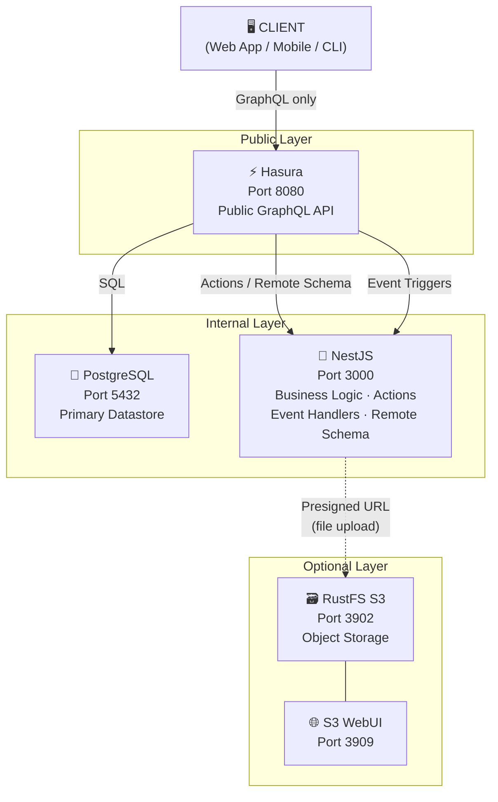

# Stratum

> **Layer by layer, project by project.**

Stratum is an open-source backend boilerplate for developers who want to bootstrap a production-ready backend stack quickly — without repeating the same infrastructure setup every time.

## What is Stratum?

Instead of spending 2–5 days setting up PostgreSQL, GraphQL, auth, object storage, and Docker from scratch, you can fork Stratum, run `./install.sh`, answer a few questions, and start writing business logic immediately.

**Core Stack:**
- 🐘 **PostgreSQL 16** — Primary datastore
- ⚡ **Hasura GraphQL Engine** — Auto-generated CRUD, permissions, subscriptions, event triggers
- 🪺 **NestJS** — Business logic layer, custom resolvers, REST endpoints, webhook handlers
- 🐳 **Docker Compose** — Local dev and production ready
- 🗃️ **RustFS S3** _(optional)_ — Lightweight self-hosted S3-compatible object storage

---

## Quick Start

```bash
# 1. Clone the repository
git clone https://github.com/your-org/stratum.git my-project
cd my-project

# 2. Run the interactive setup script
./install.sh

# 3. Start the stack
docker compose up -d
```

> **Requirements:** `docker`, `docker compose`, and `bash`. No Node.js or other runtimes required to run the install script.

---

## Architecture


```mermaid
flowchart TD
    CLIENT["🖥️ CLIENT\n(Web App / Mobile / CLI)"]

    subgraph public["Public Layer"]
        HASURA["⚡ Hasura\nPort 8080\nPublic GraphQL API"]
    end

    subgraph internal["Internal Layer"]
        PG["🐘 PostgreSQL\nPort 5432\nPrimary Datastore"]
        NESTJS["🪺 NestJS\nPort 3000\nBusiness Logic · Actions\nEvent Handlers · Remote Schema"]
    end

    subgraph optional["Optional Layer"]
        RUSTFS["🗃️ RustFS S3\nPort 3902\nObject Storage"]
        RUSTFSUI["🌐 S3 WebUI\nPort 3909"]
    end

    CLIENT -->|"GraphQL only"| HASURA
    HASURA -->|"SQL"| PG
    HASURA -->|"Actions / Remote Schema"| NESTJS
    HASURA -->|"Event Triggers"| NESTJS
    NESTJS -.->|"Presigned URL\n(file upload)"| RUSTFS
    RUSTFS --- RUSTFSUI
```

**Typical request flow:**
1. Client sends a GraphQL query/mutation directly to **Hasura** (the sole public interface)
2. Hasura enforces row-level permissions and executes against PostgreSQL
3. For custom business logic, Hasura delegates to **NestJS** via Actions or Remote Schema
4. For async side-effects (emails, notifications), Hasura fires Event Triggers to NestJS
5. For file uploads, NestJS generates a presigned URL — the client uploads directly to S3

> **Design rule:** Hasura is the sole public-facing GraphQL endpoint. NestJS is an internal service — clients never call NestJS directly. NestJS only receives requests from Hasura (actions, event triggers, remote schema).

---

## Project Structure

```
stratum/
├── install.sh                  # Interactive setup script
├── docker-compose.yml          # Generated by install.sh
├── docker-compose.base.yml     # Template: core stack
├── docker-compose.storage.yml  # Template: storage module
├── .env.example
│
├── hasura/
│   ├── migrations/             # Versioned DB migrations
│   ├── metadata/               # Hasura permissions, relationships, actions
│   └── config.yaml
│
├── nestjs/
│   ├── src/
│   │   ├── app.module.ts
│   │   ├── hasura/             # Hasura client module
│   │   ├── storage/            # StorageModule (S3 upload, presigned URLs)
│   │   └── common/             # Guards, interceptors, decorators
│   ├── Dockerfile
│   └── package.json
│
└── docs/
    ├── architecture.md
    ├── adding-feature.md
    ├── adding-tables.md
    ├── adding-resolvers.md
    ├── authentication.md
    └── storage-usage.md
```

---

## Modules

| Module | Status | Description |
|---|---|---|
| PostgreSQL + Hasura + NestJS | ✅ Core | Always included |
| S3 Object Storage (RustFS) | 🔧 Optional | Selected during `./install.sh` — swappable with any S3-compatible service |
| JWT Authentication | ✅ Included | JWT validation in Hasura + session variables forwarded to NestJS |
| PgBouncer Connection Pooling | 🗓️ Planned | Roadmap item |
| GitHub Actions CI Template | 🗓️ Planned | Roadmap item |

---

## Documentation

| Document | Description |
|---|---|
| [Architecture](./docs/architecture.md) | System design, component roles, request flow diagrams |
| [Adding a Feature](./docs/adding-feature.md) | End-to-end guide: migration → permissions → NestJS handler → Hasura action → test |
| [Adding Tables](./docs/adding-tables.md) | How to add new tables and Hasura migrations |
| [Adding Resolvers](./docs/adding-resolvers.md) | NestJS action handlers, event triggers, testing, and HasuraWebhookGuard scope |
| [Authentication](./docs/authentication.md) | JWT claims structure, session variables flow, login pattern |
| [Storage Usage](./docs/storage-usage.md) | How to use the S3 StorageModule (upload, confirm, delete) |

---

## Roadmap

### v0.1 — Proof of Concept
- [x] `docker-compose.base.yml` running (Postgres + Hasura + NestJS)
- [x] `docker-compose.storage.yml` running (RustFS + WebUI)
- [x] Install script (bash, interactive questions, auto-generated `.env`)
- [x] NestJS with StorageModule (upload presigned URL, confirm, delete)
- [x] Sample Hasura migration: `files` table + storage actions registered

### v0.2 — Developer Ready
- [x] Complete install script with input validation and optional storage toggle
- [x] Auto-enable/disable StorageModule in `app.module.ts`
- [x] Auto-generated `.env` with secrets
- [x] README and core docs (architecture, tables, resolvers, auth, storage, feature guide)
- [x] `make` targets: `up`, `down`, `reset`, `console`

### v0.3 — Production Hardened
- [ ] Health check endpoints (`/health`, `/ready`)
- [ ] Hasura connection pooling config
- [ ] Docker resource limits
- [ ] GitHub Actions CI template
- [ ] Contributing guide

---

## Contributing

Contributions are welcome! Please open an issue or PR on GitHub.

---

## License

MIT — see [LICENSE](./LICENSE)
