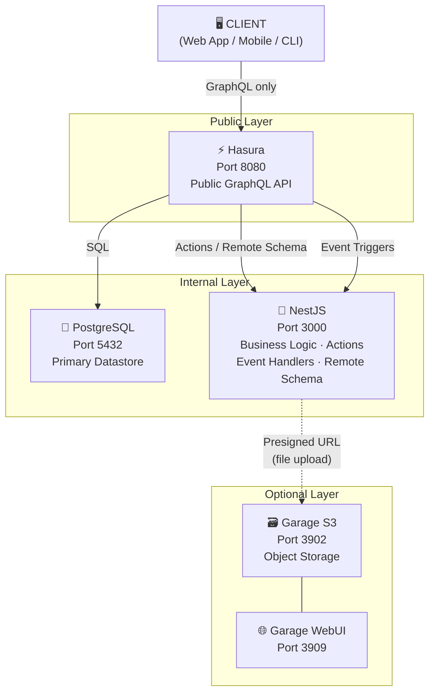
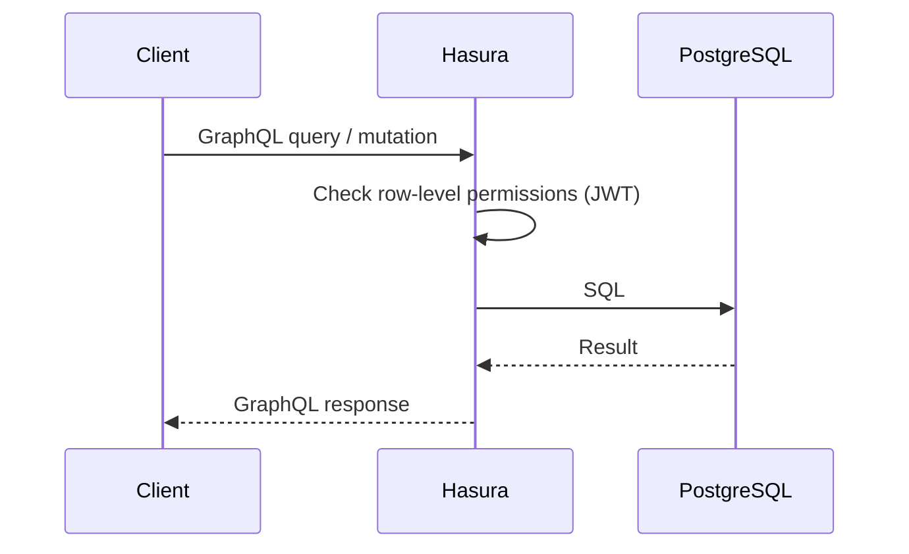
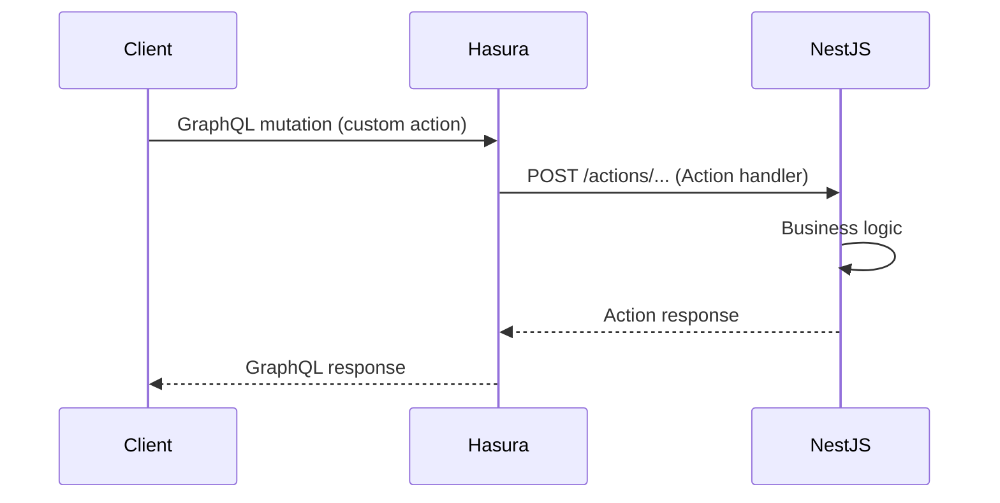
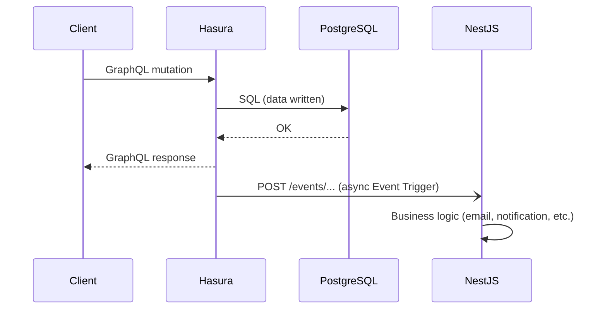
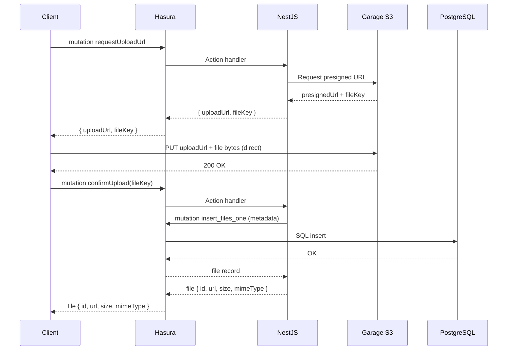
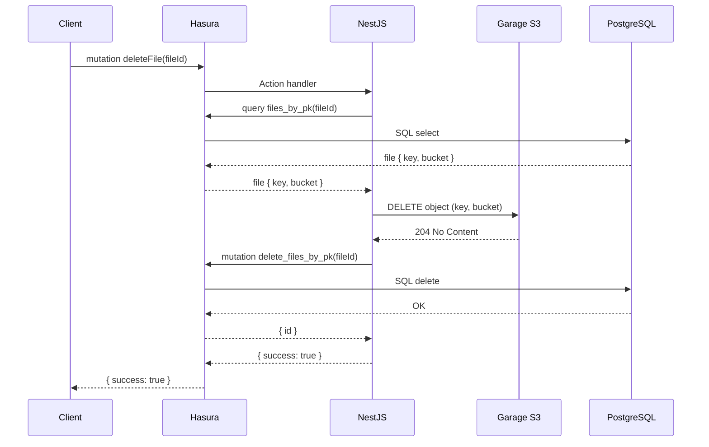

# Stratum — Architecture Overview

> This document describes the system design, component responsibilities, and data flow within the Stratum boilerplate stack.

---

## 1. Design Philosophy

Stratum follows a **layered architecture** — each layer has a single, clear responsibility:

| Layer | Component | Responsibility |
|---|---|---|
| **Public GraphQL API** | Hasura (Port 8080) | Sole public-facing endpoint, auto-generated CRUD, permissions, subscriptions |
| **Business Logic** | NestJS (Port 3000) | Internal service — action handlers, event trigger handlers, remote schema |
| **Database** | PostgreSQL (Port 5432) | Primary persistent datastore |
| **Object Storage** | Garage S3 (Port 3902) | File uploads, S3-compatible, self-hosted _(optional)_ |

**Key architectural decision:** Hasura is the **only public-facing interface**. Clients speak GraphQL directly to Hasura. NestJS is an internal service — it never receives requests from clients, only from Hasura (via Actions, Remote Schema, or Event Triggers).

---

## 2. Component Diagram

---

## 3. Component Responsibilities

### 3.1 Hasura GraphQL Engine (Port 8080)

The **sole public-facing interface** — all client traffic enters here.

**Responsibilities:**
- Expose the GraphQL API to clients (queries, mutations, subscriptions)
- Auto-generate CRUD operations for all tracked PostgreSQL tables
- Enforce row-level permissions based on JWT claims or session variables
- Expose table relationships as nested GraphQL objects
- Delegate custom business logic to NestJS via **Actions** or **Remote Schema**
- Fire **Event Triggers** to NestJS on data changes (INSERT, UPDATE, DELETE)
- Execute **Scheduled Triggers** for cron-like background jobs
- Manage database migrations (via Hasura Console or CLI)

**Does NOT:**
- Run business logic directly
- Issue authentication tokens (validates JWT, does not create them)
- Accept requests from clients on behalf of NestJS

### 3.2 NestJS (Port 3000)

An **internal service** that implements business logic on behalf of Hasura. Clients never call NestJS directly.

**Responsibilities:**
- Handle **Hasura Actions** — custom mutations/queries requiring complex logic
- Handle **Hasura Event Triggers** — webhooks fired on data changes (e.g. send welcome email on user creation)
- Expose **Remote Schema** — additional GraphQL types merged into Hasura's schema
- Validate and authenticate incoming requests from Hasura (via shared secret)
- Generate presigned URLs for Garage S3 file uploads (when StorageModule is enabled)

**Does NOT:**
- Accept requests directly from clients
- Expose any public-facing HTTP endpoints to the outside world
- Manage database schema (that's Hasura + migrations)

### 3.3 PostgreSQL 16 (Port 5432)

The **primary datastore**.

**Responsibilities:**
- Persistent storage for all application data
- Transaction management
- Indexing and query optimization
- Accessed exclusively by Hasura

### 3.4 Garage S3 (Port 3902) — Optional

A **lightweight, self-hosted, S3-compatible object store**.

**Responsibilities:**
- Store binary files (images, documents, videos, etc.)
- Issue presigned URLs (via NestJS) for direct client uploads
- Persist file metadata (URL, size, MIME type, bucket) in PostgreSQL via the `files` table

**WebUI (Port 3909):** Browser-based management for buckets and keys (dev mode only).

---

## 4. Request Flows

### 4.1 Standard CRUD (via Hasura)

For most data operations (list, get, create, update, delete), the flow never touches NestJS.

### 4.2 Custom Business Logic (via Hasura Actions)

### 4.3 Async Side Effects (via Event Triggers)

### 4.4 File Upload

### 4.5 File Delete

---

## 5. Security Model

| Concern | Approach |
|---|---|
| **Client → Hasura** | JWT in `Authorization` header; Hasura validates and extracts claims |
| **Hasura → NestJS** | Shared webhook secret in request headers; NestJS validates on every call |
| **Hasura Admin Secret** | Never exposed outside the Docker network; used only for internal Hasura config |
| **Row-level Permissions** | Defined in Hasura metadata per role — no data leaks at the database layer |
| **PostgreSQL** | Not exposed outside Docker network; accessible only by Hasura |
| **Garage S3** | Not exposed publicly; presigned URLs issued by NestJS with short TTL |
| **Hasura Console** | Enabled in `local` environment only; disabled or proxied in `production` |
| **NestJS** | Not exposed publicly; accessible only within Docker network by Hasura |

---

## 6. Technology Decisions

| Decision | Choice | Rationale |
|---|---|---|
| Public GraphQL endpoint | Hasura | Auto-generated CRUD, realtime subscriptions, event triggers out of the box |
| Business logic layer | NestJS | TypeScript, clear module system, decorator pattern — handles Hasura actions and events |
| Hasura-first pattern | Client → Hasura, Hasura → NestJS | Maximises Hasura's built-in capabilities; NestJS handles only what Hasura cannot |
| Object storage | Garage S3 | Lightest option (1 container), Apache 2.0, S3-compatible, no paywall |
| Database | PostgreSQL 16 | Best compatibility with Hasura, production-proven |
| Package manager | pnpm | Faster than npm/yarn, disk-efficient |
| Install tooling | Pure bash | No Node, Python, or other runtimes required — only Docker needed |

---

## 7. Port Reference

| Service | Exposed To | Port | Notes |
|---|---|---|---|
| Hasura | Public | 8080 | Only public-facing service |
| NestJS | Internal only | 3000 | Called by Hasura only |
| PostgreSQL | Internal only | 5432 | Called by Hasura only |
| Garage S3 API | Internal only | 3902 | Called by NestJS only |
| Garage WebUI | Dev only | 3909 | Disabled in production |

---

## 8. Environment Overview

Stratum supports three target environments, configured during `./install.sh`:

| Environment | Purpose | Key Differences |
|---|---|---|
| `local` | Developer workstation | All ports exposed, Hasura Console enabled, verbose logs |
| `staging` | Pre-production testing | Selective port exposure, SSL hints, reduced logging |
| `production` | Live deployment | No Hasura Console, resource limits, NestJS not exposed externally |

---

*See also: [Adding Tables](./adding-tables.md) · [Adding Resolvers](./adding-resolvers.md) · [Storage Usage](./storage-usage.md)*
