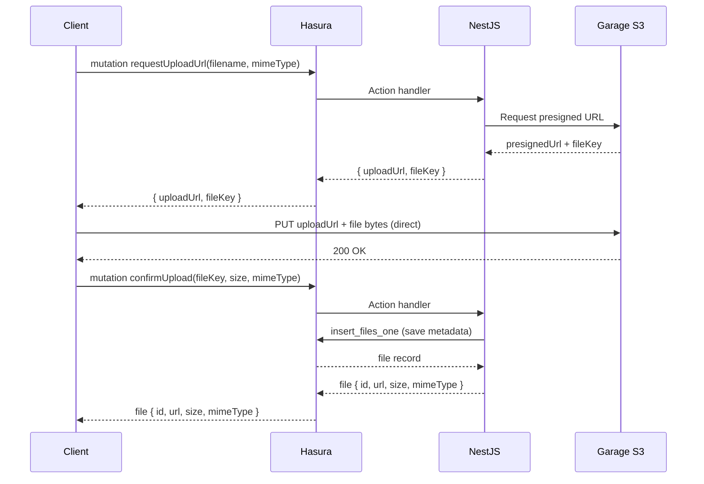

# Storage Usage (Garage S3)

> This guide explains how file upload, download, and deletion work in Stratum using the Garage S3 StorageModule.

---

## Overview

Stratum's `StorageModule` wraps [Garage](https://garagehq.deuxfleurs.fr/) — a lightweight, self-hosted, S3-compatible object store. It is an **optional module** enabled during `./install.sh`.

**Key design rules:**
- Clients **never** call Garage S3 directly without a presigned URL
- Clients **never** call NestJS directly — all requests go through **Hasura GraphQL**
- NestJS acts as an internal **Hasura Action handler** that communicates with Garage S3

**Upload flow:**


---

## Prerequisites

- StorageModule was enabled during `./install.sh`
- Stack is running: `docker compose up -d`
- `GARAGE_ACCESS_KEY`, `GARAGE_SECRET_KEY`, `GARAGE_ENDPOINT`, `GARAGE_DEFAULT_BUCKET` are set in `.env`

---

## Hasura Actions (Client Interface)

Clients interact with storage entirely through Hasura GraphQL Actions. These Actions are defined in Hasura and delegate to NestJS internally.

### `requestUploadUrl`

```graphql
# Client calls this to get a presigned URL for uploading
mutation RequestUploadUrl($filename: String!, $mimeType: String!, $bucket: String) {
  requestUploadUrl(filename: $filename, mimeType: $mimeType, bucket: $bucket) {
    uploadUrl   # PUT directly to this URL with the file bytes
    fileKey     # save this key to confirm the upload later
  }
}
```

### `confirmUpload`

```graphql
# Client calls this after the direct PUT to Garage succeeds
mutation ConfirmUpload($fileKey: String!, $size: Int!, $mimeType: String!) {
  confirmUpload(fileKey: $fileKey, size: $size, mimeType: $mimeType) {
    id
    url
    size
    mimeType
    createdAt
  }
}
```

### `deleteFile`

```graphql
# Soft-delete a file record and remove the object from Garage S3
mutation DeleteFile($fileId: uuid!) {
  deleteFile(fileId: $fileId) {
    success
  }
}
```

---

## NestJS Action Handlers (Internal)

These handlers are registered in `nestjs/src/storage/storage.action.ts` and are only called by Hasura — never directly by clients.

### `requestUploadUrl` handler

```typescript
async requestUploadUrl(
  input: { filename: string; mimeType: string; bucket?: string },
  sessionVariables: SessionVariables,
) {
  const { uploadUrl, fileKey } = await this.storageService.getPresignedUploadUrl({
    bucket: input.bucket ?? process.env.GARAGE_DEFAULT_BUCKET,
    filename: input.filename,
    mimeType: input.mimeType,
    expiresIn: 300,
  });

  return { uploadUrl, fileKey };
}
```

### `confirmUpload` handler

```typescript
async confirmUpload(
  input: { fileKey: string; size: number; mimeType: string },
  sessionVariables: SessionVariables,
) {
  const userId = sessionVariables['x-hasura-user-id'];
  const fileUrl = await this.storageService.getPublicUrl(input.fileKey);

  // Save metadata to PostgreSQL via Hasura internal mutation
  const result = await this.hasura.mutate(`
    mutation SaveFile($obj: files_insert_input!) {
      insert_files_one(object: $obj) { id url size mime_type created_at }
    }
  `, {
    obj: {
      key: input.fileKey,
      url: fileUrl,
      size: input.size,
      mime_type: input.mimeType,
      bucket: process.env.GARAGE_DEFAULT_BUCKET,
      created_by: userId,  // audit field — from session, not client
      updated_by: userId,
    }
  });

  return result.insert_files_one;
}
```

### `deleteFile` handler

```typescript
async deleteFile(
  input: { fileId: string },
  sessionVariables: SessionVariables,
) {
  const userId = sessionVariables['x-hasura-user-id'];

  // Fetch file record to get the S3 key
  const { files_by_pk: file } = await this.hasura.query(`
    query GetFile($id: uuid!) {
      files_by_pk(id: $id) { key bucket }
    }
  `, { id: input.fileId });

  if (!file) throw new Error('File not found');

  // Delete from Garage S3
  await this.storageService.deleteFile(file.key, file.bucket);

  // Soft-delete the metadata record
  await this.hasura.mutate(`
    mutation SoftDeleteFile($id: uuid!, $now: timestamptz!, $deletedBy: uuid!) {
      update_files_by_pk(
        pk_columns: { id: $id }
        _set: { deleted_at: $now, deleted_by: $deletedBy }
      ) { id }
    }
  `, { id: input.fileId, now: new Date().toISOString(), deletedBy: userId });

  return { success: true };
}
```

---

## `files` Table Schema

The `files` table stores metadata for every uploaded object. It follows the standard auditable fields convention.

| Column | Type | Description |
|---|---|---|
| `id` | UUID | Primary key |
| `key` | TEXT | S3 object key |
| `url` | TEXT | Public URL |
| `size` | INT | File size in bytes |
| `mime_type` | TEXT | MIME type |
| `bucket` | TEXT | Garage bucket name |
| `created_at` | TIMESTAMPTZ | Set by PostgreSQL `DEFAULT NOW()` |
| `created_by` | UUID → users | Set by Hasura Column Preset |
| `updated_at` | TIMESTAMPTZ | Set by Hasura Column Preset `now()` |
| `updated_by` | UUID → users | Set by Hasura Column Preset |
| `deleted_at` | TIMESTAMPTZ | Set by `deleteFile` Action |
| `deleted_by` | UUID → users | Set by Hasura Column Preset on update |

---

## StorageService API

`StorageService` (`nestjs/src/storage/storage.service.ts`) wraps the Garage S3 SDK:

```typescript
// Generate a presigned URL for client upload
getPresignedUploadUrl(options: {
  bucket?: string;
  filename: string;
  mimeType: string;
  expiresIn?: number;   // seconds, default 300
}): Promise<{ uploadUrl: string; fileKey: string }>

// Get the public URL for a stored object
getPublicUrl(key: string, bucket?: string): Promise<string>

// Generate a presigned download URL (for private buckets)
getPresignedDownloadUrl(key: string, options?: { expiresIn?: number }): Promise<string>

// Delete an object from Garage
deleteFile(key: string, bucket?: string): Promise<void>
```

---

## Garage WebUI

Access the Garage management UI at `http://localhost:3909` (dev mode only).

Use it to:
- View and create buckets
- Browse stored objects
- Manage access keys

---

## Disabling Storage Module

If you chose not to enable storage during `./install.sh`, the `StorageModule` is not imported in `app.module.ts` and Garage containers are not included in `docker-compose.yml`.

To add it later, re-run `./install.sh` and select storage, or manually:
1. Add Garage service to `docker-compose.yml` from `docker-compose.storage.yml`
2. Add storage environment variables to `.env`
3. Import `StorageModule` in `app.module.ts`

---

*See also: [Architecture](./architecture.md) · [Adding Tables](./adding-tables.md) · [Adding Resolvers](./adding-resolvers.md)*
